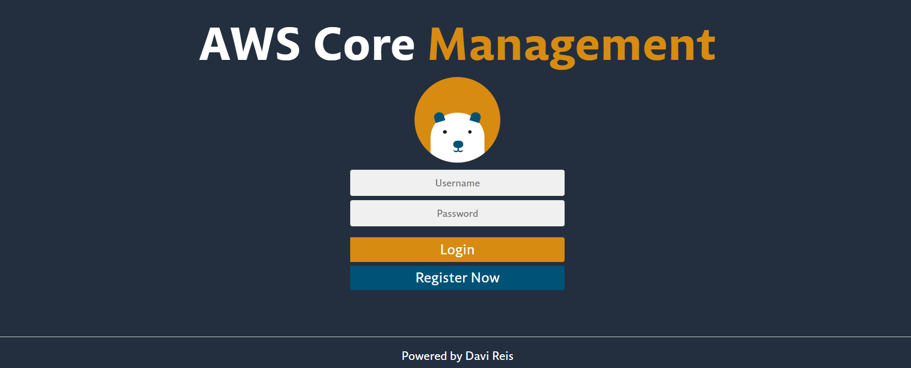
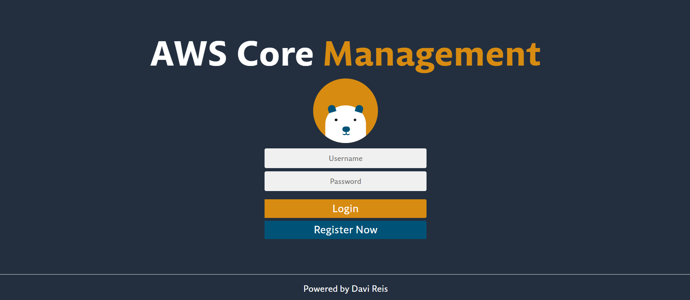
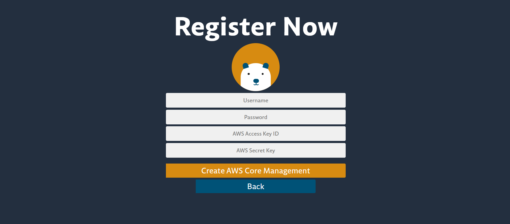
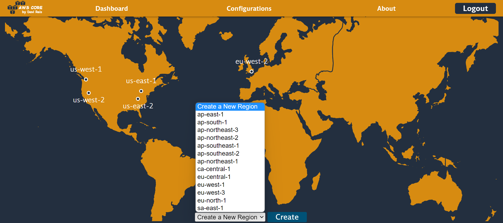
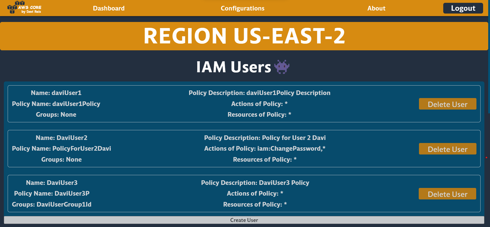
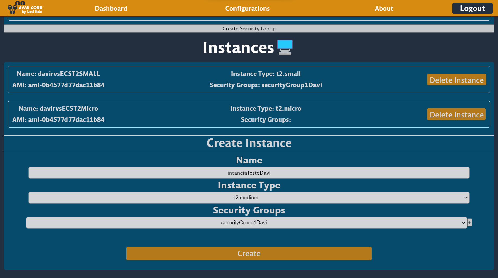
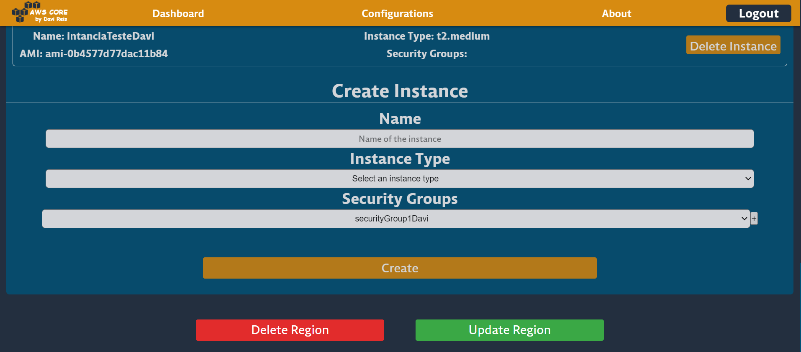

# AWS Core Management



## Description

This project is a simple example of how to use Terraform to manage AWS resources.

## Technologies

[](https://www.terraform.io/)
[](https://www.python.org/)
[](https://flask.palletsprojects.com/en/2.0.x/)
[](https://reactjs.org/)
[](https://nextjs.org/)

## Requirements

- [Terraform](https://www.terraform.io/downloads.html)
- [AWS CLI](https://docs.aws.amazon.com/cli/latest/userguide/install-cliv2.html)
- [Python 3](https://www.python.org/downloads/)
- [Node.js](https://nodejs.org/en/download/)
- [AWS Account](https://aws.amazon.com/)
- [AWS IAM User](https://docs.aws.amazon.com/IAM/latest/UserGuide/id_users_create.html)

## Usage

Execute the `install.sh` script to install the dependencies and configure the infrastructure.

```bash
$ ./install.sh
```

Open your browser and go to the URL `http://localhost:3000`. You should see the following page:

## Tutorial

1. Register in the plataform with username, password, AWS Access Key ID and AWS Secret Access Key.
   
2. After registering, you will be redirected to the login page. Log in with the username and password you registered.
   
3. After logging in, you will be redirected to the home page. Here you can see the AWS regions. Create a new region by clicking on the `Create` button after selecting the region you want to create.
   
4. You can select a specific region by clicking on the region name. Here you can see the AWS resources.
   
5. Create a new resource by clicking on the `Create` button after selecting the resource you want to create.
   
6. Update the region configuration by clicking on the `Update Region`.
   

## Concepts

### Conceito C+

Criar:

- [x] VPC criação de uma VPC e sub-rede; instâncias: esta funcionalidade deverá permitir a escolha de pelo menos 2 tipos de configuração de hosts; ainda deverá ser possível aumentar e diminuir a quantidade de instâncias; security group: criação e a associação de grupos de segurança com instâncias; Usuário no IAM.

Deletar:

- [x] Instâncias, grupos de segurança e usuário.

Listar:

- [x] Aplicação deverá listar todas instâncias e suas regiões, usuários, grupos de segurança e suas regras.

### Conceito B

Criar:

- [x] Regras em security group; Instância em mais de uma região; Associar algum tipo de restrição de acesso a um usuário;

Deletar:

- [x] Regras de security group; recursos implantados na Região;

### Conceito A

Criar:

- [x] Criar um HA de servidores web.

## Format of variables in Terraform JSON

- Security Group

```json
{
  "id": "sg-0a1b2c3d",
  "name": "sg-tcp/udp-22 - davirvs",
  "description": "Security Group for EC2",
  "ingress": [
    {
      "description": "SSH",
      "from_port": 22,
      "to_port": 22,
      "protocol": "tcp",
      "cidr_blocks": ["0.0.0.0/0"]
    }
  ],
  "egress": [
    {
      "description": "All",
      "from_port": 0,
      "to_port": 0,
      "protocol": "-1",
      "cidr_blocks": ["0.0.0.0/0"]
    }
  ]
}
```

- EC2

```json
{
  "name": "davirvs1_ubuntu2204",
  "ami": "ami-08c40ec9ead489470",
  "instance_type": "t2.micro",
  "security_groups_ids": ["sg-0a1b2c3d"]
}
```

- User

```json
{
  "name": "davirvsTeste1",
  "policies": {
    "name": "davirvsTeste1Restrictions",
    "description": "Estas são as restrições do usuário davirvsTeste1",
    "actions": ["ec2:DescribeInstances", "ec2:DescribeSecurityGroups"],
    "resources": ["*"]
  }
}
```

- Group

```json
{
  "id": "ug-0a1b2c3d",
  "name": "davirvsGroups1",
  "description": "davirvsGroups1 description",
  "policies": {
    "name": "davirvsGroups1Restrictions",
    "description": "Estas são as restrições do grupo de usuários davirvsGroups1",
    "actions": ["ec2:DescribeInstances", "ec2:DescribeSecurityGroups"],
    "resources": ["*"]
  }
}
```

## Format of JSON variable file

```json
{
  "aws-region": "us-east-2",
  "security_groups": [],
  "instances": [],
  "users": [],
  "users_groups": []
}
```
